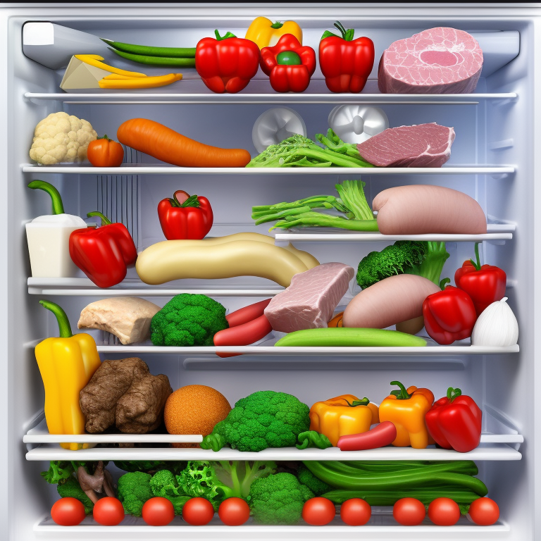
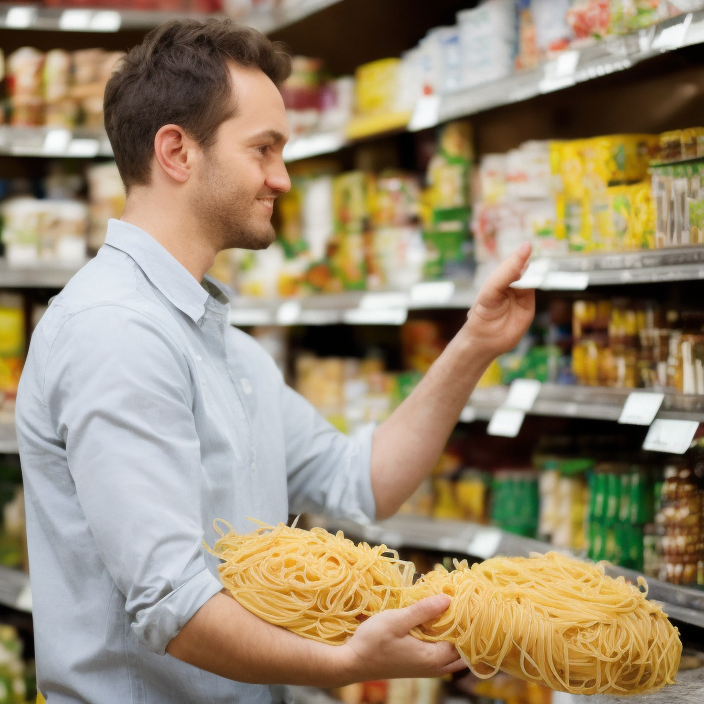
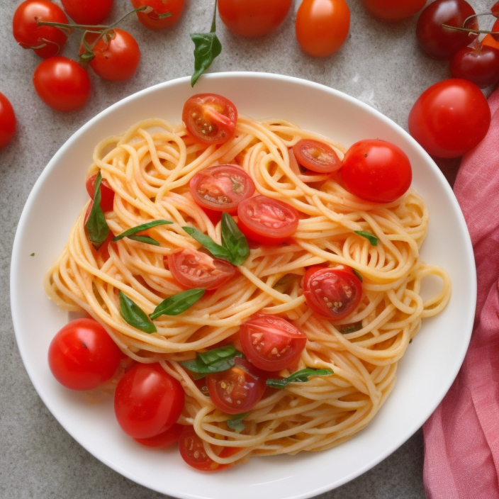

# KitchenGenie

## AI21Lab's hackathon - January 2023

### Quick Install
Installing the aplication is done by cloning this repository and then running:

`pip install -r requirements.txt`

`pip install clarifai-grpc==8.11.0`

`pip install protobuf==3.19.5`

### 🤔 What is this?

This application is built on top of AI21Lab's Large Language Models and uses them as knowledge bases to help you reduce food waste and use existing ingredients in creative ways.

### 📖 Documentation

How-to example: [A demo of how to interact with the application](https://www.youtube.com/playlist?list=PLmbqa7kiU8F9fGVrEcKu9NY_RRYbwLHWv)

### Demo

You can try out the application [here](http://34.136.12.178:8501/) (please use HTTP, not HTTPS, because we couldn't apply a certificate on the VM where we hosted our application)

### 🚀 What can this help with?

There are 2 main areas where KitcheGenie can help with. These are, in order of complexity:

- identifying recipes which can be made with already bought ingredients
- identifying ingredients for the recipe (could be more ingredients than you have)
- identifying the "grocery list" with only the extra ingredients, in case your recipe needs a few more items

### 💡 Challenges and solutions 🏆

The main way we've used the API's from AI21 Lab were focused more on the Jurrasic1-Instruct model.

We've used Few-Shot Completion model and gave it prompts along with the **Jurassic-1 Instruct** in order to "teach" our model to do some logical operations on the data that we give it, which the model couldn't do by default.

Some of the places we've used this approach are:

- generating a list of ingredients for a selected recipe, in a certain format, to allow for easy processing later on:

    - The default model returned a list of ingredients, sometimes with commas "," for describing the state of the ingredient, like ("onion, chopped"), so that we couldn't easily identify a delimiter between ingredients
    - We've trained the model to return data with ingredients delimited by "||" to allow for easier parsing of ingredients

- comparing the contents of two lists of ingredients

    - We've explored the ability of the Jurassic-1 Instruct model to understand logical operations like difference of sets.
    - We've passed along a "List 1" and "List 2" of ingredients, in text, and trained the model to show us the items that are in "List 2" but not part of "List 1". 
    
        In our application we have used this functionality to automatically determine the ingredients for our shopping list. Although sometimes the model returns items that are in both lists, this is usually rare and happens when comparing longer lists.

        We suggest having a look at the ["demo"](https://www.youtube.com/playlist?list=PLmbqa7kiU8F9fGVrEcKu9NY_RRYbwLHWv) to see how this works.

- generating hashtags that can be used to post a Tweet on Twitter.

    - We've used the same Jurassic-1 Instruct model to make it extract the most important words in a text and return them as hashtags.

All of the settings we used for "training" the model with Few-Shot prompts, for the different scenarios mentioned above, are defined in [`completion_params.json`](apis\ai21labs\completion_params.json)

---

We have also used the Zero-shot Completion and Summarization models to extend our application and enrich the story in our demo.

- We've used the Completion model to recommend recipes based on the ingredients selected in our user interface. Also, we've used this Completion model to let us know what are the ingredients for a selected recipe.

- We've used the Summarization model to do a short summary of our "story" and come up with a short text which can be later shared in a tweet, alongside the suggested hashtags that are returned by our previously mentioned Few-Shot model.

### 3rd party API's used

#### Stability AI (Stable Diffusion)
In our application we've also used the Stable Diffusion API from Stability AI to generate images to make our story more immersive. The API generated images of our fridge, like below:

We've also used the same API to generate images of the grocery shopping:

As well as images of the final cooked recipe:

#### Clarifai
After generating the image of the interior of the refrigerator, the image is sent to the [Clarifai](https://clarifai.com/) service to identify the ingredients and extract their names.

The names of the ingredients are returned and displayed in the application's multi-select element in the visual interface.
